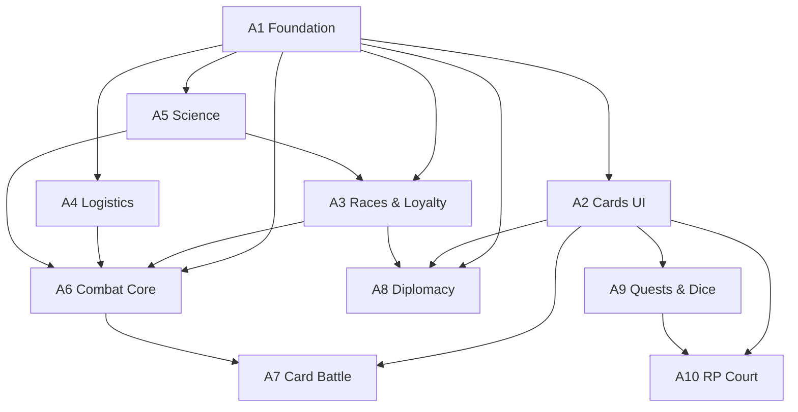

# GMap — План работ для мульти-агентного внедрения

> Версия: **1.0** · Дата: **2026-08-03**
> Опирается на: [`WORK_PLAN.md`](./WORK_PLAN.md), [`CAMPAIGN_TABLE_SPEC.md`](./CAMPAIGN_TABLE_SPEC.md), [`CAMPAIGN_TABLE_AMENDMENTS.md`](./CAMPAIGN_TABLE_AMENDMENTS.md).
> Контекст: расширение стола кампании взаимосвязанными системами (фракции, расы, лояльность, логистика, наука, бой, дипломатия, квесты, RP-режим, кубики).

Этот документ — **карта задач для 10 параллельных агентов Composer 2.5**. Каждый раздел `Agent A*` самодостаточен: агент читает только свой раздел + указанные файлы кода, не нуждаясь в полной истории чата.

---

## 0. Принципы (нерушимые для всех агентов)

1. **Сервер = единственная правда.** Все мутации мира — через `server/api.mjs` -> `processTurn.mjs` или intents. Zustand на клиенте — только вьюха.
2. **Всё новое — через `ModifierStack` + `effects.json`.** Никаких отдельных "систем лояльности/фракций" в обход стека. Новые каналы — это новые ключи в `channelKey` (`server/modifierStack.mjs`).
3. **Новые intents — в `content/core/intents.json`** с `ap` и `ops`. Новые ops — в `server/processTurn.mjs` или специализированном модуле.
4. **Контент — в JSON-паках `content/core/`**, не в коде. Новые типы эффектов — в `effects.json`.
5. **Новые состояния — расширения существующих типов** в `src/state/types.ts`. Без новых top-level таблиц. `TurnSnapshot` остаётся плоским.
6. **RNG — только серверный** (`server/dice.mjs` или `node:crypto`). Клиент только проигрывает анимацию уже известного результата.
7. **Tailwind НЕ добавлять.** Стили — plain CSS в `src/styles/app.css` с дизайн-токенами (см. `.cursor/skills/strategy-game-ui/SKILL.md`). Анимации — `motion` (Framer Motion) + `@use-gesture/react` (уже в `package.json`).
8. **Не ломать существующий пайплайн.** Каждый агент запускает `npm run smoke` и `npm run smoke:tick` после изменений — должны проходить.
9. **Чат-End Summary Rule** (`.cursor/rules/after_each_chat.mdc`): каждый агент в конце своего чата пишет `tmp/summary-{timestamp}.json`.

---

## 1. Обзор систем и зависимостей

### 1.1 Системы (что строим)

| # | Система | Кратко |
|---|---|---|
| S1 | Фракционные traits | Баффы/дебаффы держав через тот же ModifierStack |
| S2 | Расширение рас | 3-5 traits на расу с компромиссами, `xenorelations` наконец читается |
| S3 | Лояльность населения | `loyalty` 0-100, пороги, revolt->dice, связь с налогами/расами/логистикой |
| S4 | Логистика | Граф снабжения от столицы, `supplyLevel`, штрафы за отрезанность |
| S5 | Наука v2 | Апгрейды tech, брейкро (era 5), расовые/фракционные эксклюзивы, research_pact |
| S6 | Расовые юниты | `raceVariants` на существующих юнитах + 1-2 эксклюзива на расу |
| S7 | Прокачка | Veterancy (xp/level), уровни зданий, специализация через слот upgrade |
| S8 | Бой — фазы | Engagement как событие во времени, 4 фазы assault, стационарные "юниты" обороны |
| S9 | Бой — карточный режим | Опциональный tactical layer поверх того же состава |
| S10 | Дипломатия v2 | Opinion, treaties как state-объекты, новый UI (карточки, timeline) |
| S11 | Квесты v2 | Типы, арки, история, choices, diceRequired, sidebar + history layout |
| S12 | Кубики | `server/dice.mjs`, серверный RNG, RP-лог, 1d6 для ежходных квестов |
| S13 | RP-режим v2 | Двор (timeline, NPC, хроника), NPC `currentTask` с прогрессом |
| S14 | Карточки-"тарасовки" | `<DragCard>` + `<DropZone>` на `@use-gesture/react` + `motion` |
| S15 | Balance lint | `balanceBudget` на traits/techs + `scripts/lintBalance.mjs` |

### 1.2 Граф зависимостей



### 1.3 Рекомендуемый порядок запуска агентов

| Волна | Агенты | Можно параллелить |
|---|---|---|
| 1 | **A1 Foundation** | один, блокирует остальных |
| 2 | **A2 Cards UI**, **A3 Races & Loyalty**, **A4 Logistics** | параллельно (зависят только от A1) |
| 3 | **A5 Science**, **A8 Diplomacy** | параллельно (A5 ждет A3 для расовых techs, A8 ждет A3) |
| 4 | **A6 Combat Core** | один (ждет A3, A4, A5) |
| 5 | **A7 Card Battle**, **A9 Quests & Dice** | параллельно (A7 ждет A2+A6, A9 ждет A2+A3) |
| 6 | **A10 RP Court** | один (ждет A2+A9) |

---

## 2. Сводка по агентам

| Agent | Направление | Зависимости | Объём |
|---|---|---|---|
| **A1** | Foundation: effects, Faction.traits, balanceBudget | — | M |
| **A2** | Cards UI Infrastructure (DragCard, DropZone) | A1 | M |
| **A3** | Races expansion + Loyalty system | A1, A5 (для расовых techs) | L |
| **A4** | Logistics network | A1 | M |
| **A5** | Science v2 (upgrades, breakthroughs, exclusives) | A1, A3 | L |
| **A6** | Combat Core (engagement-as-event, phases, veterancy, defense units) | A1, A3, A4, A5 | XL |
| **A7** | Card Battle Mode | A2, A6 | L |
| **A8** | Diplomacy v2 (opinion, treaties, UI) | A1, A2, A3, A5 | L |
| **A9** | Quests v2 + Dice system | A1, A2, A3 | XL |
| **A10** | RP Court (NPC tasks, chronicle) | A2, A9 | L |

**Итого: 10 агентов.** Волны 1-6 — примерно 6 последовательных шагов, внутри волны — параллельно. Оценка: 4-6 недель при 1 агенте = 1 чат-сессия = 2-4 дня работы.

---

# Agent A1 — Foundation: Effects, Faction Traits, Balance Lint

## Скоуп
Расширение словаря эффектов, добавление фракционных traits, поле `balanceBudget` для последующего CI-линта. Это **базовый слой**, на который опираются все остальные агенты.

## Зависимости
Нет. Стартует первым.

## Файлы
- `GMap/content/core/effects.json` — расширить
- `GMap/content/core/faction_traits.json` — создать
- `GMap/src/state/types.ts` — расширить `Faction`
- `GMap/server/modifierStack.mjs` — расширить `channelKey`
- `GMap/server/economyTick.mjs` — собирать faction traits в стек
- `GMap/scripts/lintBalance.mjs` — создать
- `GMap/package.json` — добавить скрипт `lint:balance`
- `GMap/src/editors/PolityEditor.tsx` — UI выбора traits

## Цепочка задач

### T1.1. Расширить `effects.json` новыми типами
Добавить в `effects.effects`:
- `loyalty_add` — `{ raceId?: string, amount: number }`
- `loyalty_mult` — `{ raceId?: string, mult: number }`
- `logistics_range_add` — `{ hops: number }`
- `logistics_disconnected_penalty` — `{ productionMult: number, upkeepMult: number, combatDefMult: number }`
- `unit_upgrade` — `{ from: string, to: string }`
- `building_level_mult` — `{ mult: number }`
- `diplomacy_opinion_add` — `{ towardFactionId: string, amount: number }`
- `diplomacy_trust_decay_mult` — `{ mult: number }`
- `research_cost_mult` — `{ category?: string, mult: number }`
- `treaty_effect` — `{ treatyId: string, effect: string, args: object }`
- `revolt_risk` — `{ chancePerTurn: number }`
- `npc_task_speed_mult` — `{ mult: number }`

Каждый — с `id`, `format`, `description` (как существующие).

### T1.2. Расширить `Faction` в `types.ts`
Добавить поле `traits?: FactionTrait[]`. Создать интерфейс `FactionTrait` с полями `id`, `label`, `effects`, `balanceBudget`, `conditions?`. Если `EffectInstance` ещё не вынесен в общий тип — вынести.

### T1.3. Расширить `channelKey` в `modifierStack.mjs`
Добавить ключи для новых каналов:
- `loyalty:${a.raceId || "*"}`
- `logistics:${a.kind || "default"}`
- `diplomacy:${a.towardFactionId || "*"}`
- `research:${a.category || "*"}`
- `npc_task:${a.kind || "*"}`

`isMult`/`isFlat` обновить: `loyalty_add` — flat, `loyalty_mult` — mult, `logistics_disconnected_penalty` — other (композитный), `revolt_risk` — other.

### T1.4. Создать `content/core/faction_traits.json`
Каталог из ~15 типовых черт держав с компромиссами. Каждая — `id`, `name`, `ideology` (militarist/technocrat/trader/puritan/expansionist/isolationist/...), `effects[]`, `balanceBudget`.

Минимум 15 трейтов (по 2-3 на идеологию):
- `trait.war_economy` — +10% metal, -5% loyalty, budget 0
- `trait.technocracy` — -10% research cost, +20% building cost, budget +1
- `trait.merchant_guilds` — +15% trade income, -1 AP, budget 0
- `trait.standing_army` — +10% ship damage, +1 supply upkeep/ship, budget 0
- `trait.citizen_militia` — +20% garrison defense, -10% ship speed, budget -1
- `trait.propaganda_machine` — +2 loyalty/turn, -10% research speed, budget 0
- `trait.xenophile` — +20% diplomacy trust gain, -10% loyalty для non-human рас, budget 0
- `trait.xenophobe` — +5% loyalty для основной расы, -20% diplomacy trust gain, budget 0
- `trait.frontier_culture` — +1 logistics range, -10% stability на temperate, budget 0
- `trait.ecumenopolis` — +50% pop cap, -20% pop growth, +2 supply upkeep/turn, budget +1
- `trait.psi_doctrine` — unlock psion для не-псион-рас, -15% production, budget +2
- `trait.swarm_protocol` — +50% pop growth, forbid set_tax, budget 0
- `trait.void_navy` — -20% move cost, -1 stability на temperate, budget 0
- `trait.scholar_knights` — +10% research, +5% ship defense, -10% pop growth, budget 0
- `trait.raider_lords` — +20% bombard damage, -15% diplomacy trust, budget 0

### T1.5. Собирать faction traits в `economyTick.mjs`
В функцию сбора стека (где уже собираются race traits, building effects, tax tiers) — добавить шаг `faction.traits`. Источник: `world.factions.find(f => f.id === ownerFactionId).traits`. В `explain.lines` добавить `source: "faction"` для этих эффектов. В `explain.factionTraits[]` (новое поле рядом с `raceTraits[]`) — список `{ label, summary }`.

### T1.6. UI: выбор traits в `PolityEditor`
В `src/editors/PolityEditor.tsx` — раздел "Черты державы" (мультивыбор из `faction_traits.json`, до 3 одновременно). Сохранение в `Faction.traits`. Показывать `balanceBudget` суммы в реальном времени с предупреждением, если вне диапазона `[-2, +2]`.

### T1.7. Создать `scripts/lintBalance.mjs`
Скрипт читает `races.json` + `faction_traits.json` + `technologies.json`. Для каждой возможной комбинации (раса + до 3 фракционных traits) считает сумму `balanceBudget`. Падает с ошибкой, если вне `[-2, +2]`. Добавить в `package.json` скрипт `"lint:balance": "node scripts/lintBalance.mjs"`.

## DoD
- `effects.json` содержит все 12 новых типов эффектов.
- `Faction.traits` работает в `PolityEditor`, выбор сохраняется.
- `economyTick` применяет faction traits и они видны в `explain.factionTraits`.
- `npm run lint:balance` проходит без ошибок на текущем контенте.
- `npm run smoke` и `npm run smoke:tick` проходят.

---

# Agent A2 — Cards UI Infrastructure

## Скоуп
Общие компоненты `<DragCard>` и `<DropZone>` на `@use-gesture/react` + `motion`, которые переиспользуются агентами A7 (Card Battle), A8 (Diplomacy), A9 (Quests), A10 (RP Court). Также — портирование визуальных приёмов из Aceternity под дизайн-токены проекта.

## Зависимости
A1 (нужны новые типы эффектов для карточек квест-выборов).

## Файлы
- `GMap/package.json` — добавить `motion` (Framer Motion)
- `GMap/src/ui/DragCard.tsx` — создать
- `GMap/src/ui/DropZone.tsx` — создать
- `GMap/src/ui/CardVisual.tsx` — создать (общий стиль карточки)
- `GMap/src/styles/app.css` — добавить стили карточек
- `GMap/src/ui/dragCardDemo.tsx` — создать (демо-страница для проверки)

## Цепочка задач

### T2.1. Установить `motion`
Добавить в `package.json` зависимость `motion` (Framer Motion v11+, совместим с React 19). Запустить `npm install`.

### T2.2. Создать `<DragCard>`
Компонент на `@use-gesture/react` (`useDrag`) + `motion` для spring-физики. Props:
- `cardId: string` — идентификатор (для key)
- `title: string`
- `subtitle?: string`
- `icon?: ReactNode`
- `accent?: string` — цвет рамки/подсветки
- `children?: ReactNode` — контент карточки
- `onDragEnd?: (pos: { x, y }) => void`
- `onDropZone?: (zoneId: string) => void` — срабатывает при отпускании над DropZone
- `pinned?: boolean` — запрещает drag
- `tilt?: boolean` — наклон при перетаскивании (3D-эффект Aceterty)

Позиция карточки — локальный state компонента (spring). При `onDragEnd` — вызов колбэка с позицией. При попадании в DropZone — `onDropZone` с id зоны.

### T2.3. Создать `<DropZone>`
Компонент-контейнер, который реагирует на перетаскиваемую карточку. Props:
- `zoneId: string`
- `accepts?: string[]` — фильтр по `cardId` или типу
- `onDrop?: (cardId: string) => void`
- `highlight?: boolean` — подсветка при наведении
- `children?: ReactNode` — содержимое зоны

Использует `@use-gesture/react` `useDrag` на родителе для определения hover-зоны (через `getBoundingClientRect`).

### T2.4. Создать `<CardVisual>`
Базовый визуал карточки: рамка, тень, радиус, фон — все через CSS-токены из `app.css` (`var(--surface)`, `var(--border)`, и т.д.). Стиль — портированный из Aceterty `3D Card Effect` / `Wobble Card`, но **без Tailwind-классов**. Все стили в `app.css` с классами `drag-card`, `drag-card--dragging`, `drag-card--tilt`.

### T2.5. Демо-страница
Создать `src/ui/dragCardDemo.tsx` — холст с 3 карточками и 2 drop-зонами ("Даю" / "Хочу"). Доступна по временному роуту `/demo/cards`. Проверить: drag работает, spring-физика плавная, drop-зоны подсвечиваются, tilt-эффект при перетаскивании.

### T2.6. Документация для других агентов
В конце файла `src/ui/DragCard.tsx` — комментарий с примером использования, чтобы агенты A7-A10 могли скопировать паттерн без чтения всего кода.

## DoD
- `motion` установлен, `npm run build` проходит.
- `<DragCard>` и `<DropZone>` работают на демо-странице.
- Стили используют дизайн-токены, не Tailwind.
- `npm run smoke` проходит.

---

# Agent A3 — Races Expansion + Loyalty System

## Скоуп
Расширение каталога рас (3-5 traits на расу с компромиссами), система лояльности населения (0-100, пороги, revolt->dice), использование `xenorelations` (сейчас не читается), `raceVariants` на юнитах.

## Зависимости
- A1 (нужны `loyalty_add`, `loyalty_mult`, `revolt_risk` в `effects.json`)
- A5 (для расовых эксклюзивных techs — но A3 может работать без них, добавив `raceLock` поле в techs, которое A5 заполнит)

## Файлы
- `GMap/content/core/races.json` — расширить
- `GMap/content/core/loyalty_tiers.json` — создать
- `GMap/content/core/units.json` — добавить `raceVariants`
- `GMap/content/core/ships.json` — добавить `raceVariants`
- `GMap/src/state/types.ts` — расширить `Planet`, `Race`
- `GMap/server/loyalty.mjs` — создать
- `GMap/server/economyTick.mjs` — вызов loyalty tick
- `GMap/server/processTurn.mjs` — вызов loyalty tick + revolt check
- `GMap/server/combatResolve.mjs` — loyalty penalty к обороне
- `GMap/src/viewer/SystemDossier.tsx` — UI лояльности
- `GMap/src/editors/PolityEditor.tsx` — UI расовых traits

## Цепочка задач

### T3.1. Расширить `races.json`
Для каждой из 3 существующих рас (human, belator, synth) — добавить 3-5 traits с компромиссами. Добавить 3-4 новые расы (karned, psionic, swarm, voidborn). Каждая раса: `id`, `name`, `tags`, `traits[]` (каждый trait — `id`, `effects[]`, `balanceBudget`), `habitability`, `growth`, `xenorelations` (матрица к другим расам).

Примеры расовых traits:
- `trait.belator.discipline` (есть) — +10% defense, +1 supply upkeep
- `trait.belator.militarist_loyalty` — loyalty растёт от военного налога (вместо падения)
- `trait.synth.efficient` (есть) — +5% metal, -30% pop growth
- `trait.synth.logistics_independent` — +1 logistics range, -10% loyalty на планетах с climate ocean
- `trait.human.adaptable` — +5% tech speed, +10% diplomacy trust gain
- `trait.human.cosmopolitan` — +1 loyalty для смешанных планет, -5% production

### T3.2. Расширить `Race` в `types.ts`
Добавить поля: `traits?: RaceTrait[]`, `xenorelations?: Record<string, number>`. Если `Race` сейчас только `{ id, name }` — расширить до полного типа с `traits`, `habitability`, `growth`, `xenorelations`.

### T3.3. Создать `content/core/loyalty_tiers.json`
```json
{
  "loyalty_tiers": [
    { "max": 20, "effects": [{ "effect": "revolt_risk", "args": { "chancePerTurn": 0.1 } }, { "effect": "production_mult", "args": { "mult": 0.7 } }] },
    { "min": 20, "max": 40, "effects": [{ "effect": "production_mult", "args": { "mult": 0.85 } }] },
    { "min": 40, "max": 60, "effects": [] },
    { "min": 60, "max": 80, "effects": [{ "effect": "production_mult", "args": { "mult": 1.05 } }] },
    { "min": 80, "effects": [{ "effect": "production_mult", "args": { "mult": 1.10 } }, { "effect": "loyalty_add", "args": { "amount": 1 } }] }
  ]
}
```

### T3.4. Создать `server/loyalty.mjs`
Функции:
- `computePlanetLoyalty(world, system, planet, content)` — считает лояльность планеты как `sum(raceShare.percent * loyalty[raceId][ownerFactionId])`. Базовая лояльность — 50, модифицируется: `xenorelations` расы к фракции, `tax_pressure`, `propaganda` POI, `logistics.disconnected`, `after_battle` consequence.
- `loyaltyTick(world, factionId, content)` — на тике: обновляет `loyalty` стейт для всех планет фракции, применяет `loyalty_tiers` effects.
- `checkRevolt(world, system, planet, content)` — если `loyalty < 20`, бросает кубик (через `server/dice.mjs` — если он уже есть от A9, иначе через `node:crypto` напрямую). При провале — создаёт revolt событие (spawn rebels, switch owner, refugees POI).

Хранение: `planet.loyalty: number` (0-100) и `world.loyaltyMatrix: Record<raceId, Record<factionId, number>>` (в `TurnSnapshot` — только текущие значения, без истории).

### T3.5. Интегрировать в `processTurn.mjs`
После `economyTick` — вызвать `loyaltyTick` для каждой фракции. После loyalty tick — `checkRevolt` для всех планет с `loyalty < 20`. Revolt события — в journal как `type: "revolt"`.

### T3.6. Loyalty penalty в бою
В `combatResolve.mjs` — при расчёте обороны защитника, если планета имеет `loyalty < 40`, применить `combatDefMult: 0.8` (гарнизон хуже держит). Если `loyalty < 20` — шанс что гарнизон переходит на сторону атакующего (через dice check).

### T3.7. `raceVariants` на юнитах
В `units.json` и `ships.json` — добавить поле `raceVariants?: Record<raceId, { statsMult: Record<stat, number>, name: string }>` на существующие юниты. Пример:
```json
"unit.generic_line": {
  "id": "unit.generic_line",
  "raceVariants": {
    "race_belator": { "statsMult": { "defense": 1.15 }, "name": "Легион Белатора" },
    "race_synth": { "statsMult": { "hp": 0.9, "speed": 1.2 }, "name": "Синт-дрон" }
  }
}
```
В `combatResolve.mjs::gatherGroups` — при создании группы проверять `raceVariants[raceId]` (раса берётся из `legion.raceId` или из состава населения системы для флота) и применять `statsMult`.

### T3.8. UI лояльности
В `SystemDossier.tsx` — кольцевая диаграмма лояльности по расам планеты. В `PolityEditor` — показ расовых traits с `balanceBudget`. Map mode "Лояльность" (красный/желтый/зеленый ореол систем) — добавить в `Toolbar` map modes.

## DoD
- 6-7 рас с 3-5 traits каждая, все с `balanceBudget`.
- `xenorelations` читается и влияет на лояльность.
- `loyalty` считается на тике, `revolt_risk` срабатывает при низких значениях.
- `raceVariants` применяются в бою.
- `npm run lint:balance` проходит.
- `npm run smoke:tick` проходит (с лояльностью).

---

# Agent A4 — Logistics Network

## Скоуп
Граф снабжения от столицы через `SystemLink`, `supplyLevel` (затухает с числом хопов), штрафы за отрезанность, map mode "Логистика".

## Зависимости
A1 (нужны `logistics_range_add`, `logistics_disconnected_penalty` в `effects.json`).

## Файлы
- `GMap/content/core/rules.json` — расширить секцией `logistics`
- `GMap/server/logistics.mjs` — создать
- `GMap/server/processTurn.mjs` — вызов logistics tick
- `GMap/server/economyTick.mjs` — применение supplyLevel к производству
- `GMap/server/combatResolve.mjs` — применение combatDefMult при отрезанности
- `GMap/server/pathfinding.mjs` — использовать для BFS
- `GMap/src/state/types.ts` — расширить `StarSystem`
- `GMap/src/renderers/drawMapFeatures.ts` — линии логистики
- `GMap/src/editors/Toolbar.tsx` — map mode "Логистика"
- `GMap/src/viewer/SystemDossier.tsx` — блок "Снабжение"

## Цепочка задач

### T4.1. Расширить `rules.json`
Добавить секцию `logistics`:
```json
"logistics": {
  "baseRangeHops": 3,
  "depotRangeBonus": 2,
  "supplyDecayPerHop": 0.15,
  "connectedBonuses": [
    { "effect": "production_mult", "args": { "resource": "currency.industria", "mult": 1.05 } },
    { "effect": "ap_add", "args": { "amount": 1 } }
  ],
  "disconnectedPenalties": [
    { "effect": "logistics_disconnected_penalty", "args": { "productionMult": 0.5, "upkeepMult": 1.3, "combatDefMult": 0.7 } }
  ],
  "blockadedIsDisconnected": true,
  "quarantineBreaksLogistics": true
}
```

### T4.2. Расширить `StarSystem` в `types.ts`
```typescript
export interface StarSystem {
  // ...существующее
  logistics?: {
    connectedToCapital: boolean;
    hopsToCapital: number;
    viaDepot: boolean;
    supplyLevel: number;     // 0..1
    bottlenecked: boolean;   // разрыв/блокада/карантин на маршруте
    computedAtTurn?: number; // для кеширования
  };
}
```

### T4.3. Создать `server/logistics.mjs`
Функции:
- `computeLogisticsNetwork(world, factionId, content)` — BFS от столицы (`faction.capitalSystemId` или первая система с `isCapital`) по `SystemLink` с типами `corridor|gate`. Проходит только через системы владельца или союзников (trade/alliance). Депо POI на маршруте продлевает радиус на `depotRangeBonus`. Карантин POI на маршруте — обрывает путь.
- `computeSupplyLevel(hops, content)` — `1 / (1 + supplyDecayPerHop * hops)`.
- `applyLogisticsEffects(world, factionId, content)` — для каждой системы: если `connected` — применить `connectedBonuses` (масштабировать на `supplyLevel`), если `!connected` — `disconnectedPenalties`.

### T4.4. Интегрировать в `processTurn.mjs`
Перед `economyTick` — вызвать `computeLogisticsNetwork` для каждой фракции. После — `applyLogisticsEffects`. Записать `system.logistics` в world.

### T4.5. Применить в `economyTick.mjs`
При сборе стека для планеты — если `system.logistics.connectedToCapital === false`, добавить `disconnectedPenalties` effects. Если `connected` — `connectedBonuses` масштабированные на `supplyLevel`.

### T4.6. Применить в `combatResolve.mjs`
При расчёте обороны защитника — если система `logistics.connectedToCapital === false`, применить `combatDefMult` из `disconnectedPenalties`.

### T4.7. Map mode "Логистика"
В `Toolbar.tsx` — добавить map mode "logistics" (горячая клавиша, например F10). В `drawMapFeatures.ts` — рисовать линии: зелёная = связана, жёлтая = узкое место (`bottlenecked`), красная = отрезана. Толщина линии ~ `supplyLevel`.

### T4.8. UI в `SystemDossier`
Блок "Снабжение": `4 хопа до столицы, через Тангар · supplyLevel: 0.72`. Если отрезана — красное предупреждение.

## DoD
- `logistics.mjs` считает сеть для каждой фракции на тике.
- Отрезанные системы получают штрафы к производству и обороне.
- Map mode "Логистика" показывает линии снабжения.
- `SystemDossier` показывает статус снабжения.
- `npm run smoke:tick` проходит.

---

# Agent A5 — Science v2: Upgrades, Breakthroughs, Exclusives

## Скоуп
Апгрейды изученных tech (углубление вместо ширины), брейкро-tech (era 5), расовые/фракционные эксклюзивы, research_pact как дипло-тип, расширение UI `ResearchPanel`.

## Зависимости
- A1 (нужны `research_cost_mult`, `unit_upgrade` в `effects.json`)
- A3 (нужны расы для `raceLock` на techs)

## Файлы
- `GMap/content/core/technologies.json` — расширить (upgrades, breakthroughs, exclusives)
- `GMap/content/core/intents.json` — добавить `intent.research_upgrade`
- `GMap/server/techActions.mjs` — расширить (апгрейд tech)
- `GMap/server/diploOffers.mjs` — добавить тип `research_pact`
- `GMap/src/state/types.ts` — расширить `TechnologyDef`
- `GMap/src/state/contentCatalog.ts` — расширить
- `GMap/src/viewer/ResearchPanel.tsx` — расширить UI
- `GMap/src/viewer/ResearchRadialTree.tsx` — расширить UI

## Цепочка задач

### T5.1. Расширить модель tech в `types.ts` и `contentCatalog.ts`
Добавить в `TechnologyDef`:
```typescript
interface TechnologyDef {
  // ...существующее
  upgrades?: TechUpgrade[];      // апгрейды изученной tech
  raceLock?: string;             // только для этой расы (требует >=30% в населении)
  factionTraitLock?: string;     // только для фракций с этим trait
  isBreakthrough?: boolean;      // брейкро-tech (era 5+)
}

interface TechUpgrade {
  id: string;
  name: string;
  cost: { "currency.cognitio": number };
  effects: EffectInstance[];
  prerequisites: string[];       // требует родительскую tech изученной
  balanceBudget: number;
}
```

### T5.2. Добавить апгрейды в `technologies.json`
Для каждого из 21 существующих tech — добавить 2-3 апгрейда. Три категории:
1. **Эффективность** — +множитель к эффекту tech (например, `tech.fusion.overclock` -> +10% energia output).
2. **Снижение стоимости** — -upkeep для всего, что tech открывает.
3. **Новая функция** — +unlock_property или новый эффект (например, `tech.psionics.xeno_training` -> открывает psion для не-псион-рас через дорогой апгрейд).

### T5.3. Добавить брейкро-tech (era 5)
3-5 tech с `isBreakthrough: true`, `era: 5`, требуют property `matter_destroy` или `corridor_open`. Открывают: `ship.black_iron` (уже в `ships.json`), `ship.psi_cruiser` (уже), планетарные мегаструктуры, белые коридоры как постройка.

### T5.4. Добавить расовые эксклюзивы
2-3 tech на расу с `raceLock`. Требуют >=30% этой расы в населении фракции (проверка в `techActions.mjs`). Примеры:
- `tech.psionic.resonance` (raceLock: psionic) -> +20% psi damage
- `tech.swarm.adaptation` (raceLock: swarm) -> +50% pop growth на отрезанных системах
- `tech.synth.uplift` (raceLock: synth) -> открывает синт-эксклюзивный юнит

### T5.5. Добавить фракционные эксклюзивы
2-3 tech с `factionTraitLock`. Требуют наличия trait у фракции. Примеры:
- `tech.technocracy.ai_research` (factionTraitLock: trait.technocracy) -> +20% cognitio output
- `trait.war_economy.doctrine` (factionTraitLock: trait.war_economy) -> +15% ship damage

### T5.6. Intent `intent.research_upgrade`
В `intents.json`:
```json
"intent.research_upgrade": {
  "id": "intent.research_upgrade",
  "ap": 1,
  "ops": ["research_upgrade"],
  "params": ["techId", "upgradeId"]
}
```
В `techActions.mjs` — функция `researchUpgrade(eco, techId, upgradeId, content)`: проверка что родитель изучен, списание `cognitio`, применение `upgrade.effects`.

### T5.7. Research pact в `diploOffers.mjs`
Новый тип оффера `research_pact`: обе стороны обмениваются `unlockedTechs` (или дают друг другу `production_mult: cognitio 1.05`). При accept — применяется через `treaty_effect` в ModifierStack.

### T5.8. UI: расширить `ResearchPanel` и `ResearchRadialTree`
- На узел tech — иконка "прокачан" (звёздочки для изученных upgrades).
- Кнопка "Улучшить" рядом с "Изучить" для изученных tech.
- Подсветка расовых/фракционных эксклюзивов (иконка замка, tooltip "Только для расы X").
- Прогресс-бар Cognitio (накоплено / стоимость).
- Брейкро-tech — отдельным цветом/радиусом на radial tree.

## DoD
- 21 базовый tech + ~60 апгрейдов + ~15 брейкро/расовых/фракционных = ~95 узлов.
- `intent.research_upgrade` работает, списает cognitio, применяет effects.
- `research_pact` работает через дипло-офферы.
- UI показывает апгрейды, эксклюзивы, брейкро.
- `npm run smoke:tick` проходит.

---

# Agent A6 — Combat Core: Engagement-as-Event, Phases, Veterancy, Defense Units

## Скоуп
Превращение боя из атомарной операции в тике в **событие во времени** (engagement живёт между тиками, ждёт stance от игрока). 4-фазная модель assault (bombard -> landing -> ground -> occupation). Стационарные "юниты" планетарной обороны. Veterancy юнитов (xp/level).

## Зависимости
- A1 (нужны `unit_upgrade` в `effects.json`)
- A3 (нужна loyalty penalty к обороне)
- A4 (нужна logistics `combatDefMult` при отрезанности)
- A5 (нужны `unit_upgrade` tech-эффекты для уровней юнитов)

## Файлы
- `GMap/server/engagements.mjs` — переписать логику создания/резолва
- `GMap/server/combatResolve.mjs` — расширить (фазы, veterancy)
- `GMap/server/processTurn.mjs` — изменение порядка резолва
- `GMap/content/core/units.json` — стационарные "юниты" обороны
- `GMap/content/core/rules.json` — секция `veterancy`, `engagement`
- `GMap/content/core/intents.json` — `intent.request_card_battle` (заглушка для A7)
- `GMap/src/state/types.ts` — расширить `Engagement`, `ShipGroup`, `Legion`
- `GMap/src/editors/CombatPanel.tsx` — UI фаз
- `GMap/src/viewer/EngagementStanceRing.tsx` — починить (теперь работает)
- `GMap/src/viewer/ForcesArmory.tsx` — veterancy звёзды

## Цепочка задач

### T6.1. Engagement как событие во времени
Изменить в `engagements.mjs::createEngagement`:
- `status: "commit"` -> `status: "active"` (не резолвится сразу).
- `locked: true` -> `locked: false` для обеих сторон.
- Добавить `startedTurn`, `roundsElapsed: 0`, `maxRounds: 3`, `requiresPlayerInput: true`.

В `processTurn.mjs`:
- Если есть `engagement.status === "active"` с `requiresPlayerInput` — **не резолвить**, оставить на следующий тик.
- Показать в Inbox "Бой в системе X, выберите stance".
- Если `roundsElapsed >= maxRounds` — форс-резолв с auto-locked (автобой).
- Если обе стороны `locked` (через `intent.combat_stance`) — резолвить.

### T6.2. Починить stance-UI
`intent.combat_stance` уже есть в `intents.json`. Теперь, когда engagement не резолвится сразу, у игрока есть окно между тиками для выбора stance. `EngagementStanceRing` и `FleetOrderRing` — проверить, что они вызывают `intent.combat_stance` с правильным `engagementId`.

### T6.3. Veterancy в `composition`
Расширить `ShipGroup` и легионный composition-элемент:
```typescript
interface ShipGroup {
  type: string;
  count: number;
  hp?: number;
  filledSlots?: Record<string, string>;
  xp?: number;     // новое
  level?: number;  // новое, 0..5
}
```

В `rules.json` — секция `veterancy`:
```json
"veterancy": {
  "thresholds": [0, 100, 250, 500, 900, 1500],
  "bonuses": [
    {},
    { "stat_mult": { "defense": 1.05 } },
    { "stat_mult": { "defense": 1.10, "damage": 1.05 } },
    { "stat_mult": { "defense": 1.15, "damage": 1.10 } },
    { "stat_mult": { "defense": 1.20, "damage": 1.15 } },
    { "stat_mult": { "defense": 1.25, "damage": 1.20 } }
  ],
  "xpPerBattle": 50,
  "xpLossOnUnitUpgrade": 0.5
}
```

В `combatResolve.mjs::gatherGroups` — после `def.stats` применить `veterancyBonuses[level]`. В `combatResolve.mjs` после боя — начислить `xp += xpPerBattle` всем выжившим группам. При `unit_upgrade` (через tech) — `xp *= xpLossOnUnitUpgrade`.

### T6.4. Стационарные "юниты" планетарной обороны
В `units.json` добавить:
```json
"unit.planetary_gun": {
  "id": "unit.planetary_gun",
  "name": "Планетарное орудие",
  "faction": "generic",
  "tier": 3,
  "roles": ["garrison"],
  "stats": { "damage": 18, "defense": 30, "hp": 200, "speed": 0 },
  "targeting": "assault_first",
  "theaterMult": { "ground": 1, "assault": 1, "space": 0 }
},
"unit.shield_dome": {
  "id": "unit.shield_dome",
  "name": "Щитовой купол",
  "faction": "generic",
  "tier": 4,
  "roles": ["garrison"],
  "stats": { "damage": 0, "defense": 10, "shields": 80, "hp": 150, "speed": 0 },
  "targeting": "garrison_first",
  "theaterMult": { "ground": 1, "assault": 1, "space": 0 }
},
"unit.bunker": {
  "id": "unit.bunker",
  "name": "Бункер",
  "faction": "generic",
  "tier": 3,
  "roles": ["garrison"],
  "stats": { "damage": 8, "defense": 50, "hp": 300, "speed": 0 },
  "targeting": "assault_first",
  "theaterMult": { "ground": 1, "assault": 1, "space": 0 }
}
```

В `gatherGroups` — для защитника планеты: если на планете есть здания `defense` -> добавить 1 `unit.bunker` и 1 `unit.planetary_gun` за здание. Если `barracks` -> +1 `unit.bunker`. Если есть `building.shield_array` (новое, или использовать существующее) -> +1 `unit.shield_dome`.

### T6.5. 4-фазная модель assault
Расширить `Engagement`:
```typescript
interface Engagement {
  // ...существующее
  phase?: "bombard" | "landing" | "ground" | "occupation";
  planetId?: string | null;
  orbitalControl?: "attacker" | "defender" | "contested";
  defenseLayers?: {
    orbital: { guns: number; shields: number };
    surface: { guns: number; bunkers: number };
    garrison: { unitIds: string[]; fortBonus: number };
  };
}
```

В `combatResolve.mjs` — разбить резолв assault на последовательность:
1. **Bombard** — только `bombard`-роль (`ship.dreadnought`, `ship.battleship`) бьёт по `defenseLayers.orbital` и `surface`. Наземные юниты не отвечают. Цель — подавить ПВО.
2. **Landing** — `assault`-юниты (`unit.breach_cadre`) высаживаются, штраф если `orbital.shields > 0`. Наземные `garrison`/`infantry` отвечают.
3. **Ground** — `infantry`/`armor`/`psi` vs `garrison`/`infantry`. Бонус от `defense` зданий (+defense), `barracks` (+garrison HP).
4. **Occupation** — если защитников 0, планета переходит к атакующему. `population` получает `stability_add: -3` (оккупация), шанс `refugees` POI.

Каждая фаза — отдельный "раунд" в engagement. Между фазами — окно для stance-выбора (если `requiresPlayerInput`).

### T6.6. UI: `CombatPanel` фазовая лента
В `CombatPanel.tsx` — добавить ленту из 4 шагов сверху, подсветка активной фазы. Кнопки "Перейти к следующей фазе" для GM (early resolve уже есть в `rules.combat.allowEarlyResolve`).

### T6.7. UI: veterancy звёзды в `ForcesArmory`
В `ForcesArmory.tsx` — рядом с каждым стеком состава показывать звёздочки veterancy (0-5). Tooltip с текущими бонусами.

### T6.8. Заглушка `intent.request_card_battle`
В `intents.json` — добавить intent (ap: 0, params: engagementId). В `engagements.mjs` — обработка: если обе стороны прислали `request_card_battle` для одного engagement -> `engagement.mode = "card"` (A7 реализует сам режим). Пока — просто флаг, который не делает ничего.

## DoD
- Engagement живёт между тиками, ждёт stance от игрока.
- `EngagementStanceRing` работает (игрок может выбрать stance).
- 4-фазный assault резолвится последовательно.
- Стационарные юниты обороны участвуют в бою.
- Veterancy начисляется и применяется.
- `npm run smoke:tick` проходит (с боем).

---

# Agent A7 — Card Battle Mode

## Скоуп
Опциональный карточный режим боя поверх того же состава флота/легиона. Не колодостроение, не ККИ — разыгрывание существующих юнитов как карт. Серверный резолв хода, детерминированный.

## Зависимости
- A2 (нужны `<DragCard>` и `<DropZone>`)
- A6 (нужен engagement-as-event, `intent.request_card_battle`, `engagement.mode`)

## Файлы
- `GMap/server/cardBattle.mjs` — создать
- `GMap/server/engagements.mjs` — обработка `engagement.mode === "card"`
- `GMap/server/processTurn.mjs` — вызов card battle резолва
- `GMap/content/core/intents.json` — `intent.play_card`
- `GMap/content/core/rules.json` — секция `cardBattle`
- `GMap/src/state/types.ts` — типы карточного боя
- `GMap/src/viewer/CardBattleTable.tsx` — создать
- `GMap/src/viewer/ViewerPage.tsx` — интеграция

## Цепочка задач

### T7.1. Правила карточного боя в `rules.json`
```json
"cardBattle": {
  "handSize": 4,
  "drawPerRound": 1,
  "maxRounds": 8,
  "forceCardThreshold": 5,
  "triggers": {
    "mutualConsent": true,
    "gmForce": true,
    "powerCorridor": { "min": 0.40, "max": 0.60 }
  }
}
```

### T7.2. Типы в `types.ts`
```typescript
interface CardBattleState {
  engagementId: string;
  hands: { [sideId: string]: BattleCard[] };
  decks: { [sideId: string]: BattleCard[] };
  discard: { [sideId: string]: BattleCard[] };
  frontLines: { [sideId: string]: BattleCard[] };
  round: number;
  currentSide: string;
  status: "active" | "resolved";
  log: CardBattleLogEntry[];
}

interface BattleCard {
  cardId: string;
  defId: string;       // ссылка на ship/unit def
  role: string;
  count: number;
  hp: number;
  maxHp: number;
  damage: number;
  defense: number;
  shields: number;
  accuracy: number;
  targeting: string;
  filledSlots: Record<string, string>;
  veterancyLevel: number;
}

interface CardBattleLogEntry {
  round: number;
  side: string;
  action: "play" | "pass" | "resolve";
  cardId?: string;
  outcome?: { winnerCard?: string; loserCard?: string; damageDealt?: number };
}
```

### T7.3. Создать `server/cardBattle.mjs`
Функции:
- `prepareCardBattle(engagement, world, content)` — превращает `composition[]` обеих сторон в колоды. Каждый стек `composition[i]` -> одна карточка. Тяжёлые стеки (count > 5) разбиваются на 2-3 карты по 3-5 юнитов. Раздаёт по `handSize` карт.
- `resolveCardPair(attackerCard, defenderCard, content)` — matchup-множитель из `combat_matchups.json` + property-мульт из `propertyCombatMult`. Возвращает `{ winnerCard, loserCard, damageDealt }`.
- `playCardRound(state, sideId, cardId, content)` — игрок кладёт карту в линию фронта. Если у оппонента есть карта в линии — резолв пары. Если нет — карта бьёт по "базе" (HP флота/легиона).
- `checkEndCondition(state)` — 8 раундов или рука+колода пуста у одной стороны.
- `finalizeCardBattle(state, world)` — записывает потери обратно в `composition` флота/легиона. Оставшиеся count на картах = выжившие.

### T7.4. Intent `intent.play_card`
В `intents.json`:
```json
"intent.play_card": {
  "id": "intent.play_card",
  "ap": 0,
  "ops": ["play_card"],
  "params": ["engagementId", "cardId"]
}
```
В `processTurn.mjs` — обработка: если `engagement.mode === "card"`, вызвать `playCardRound`.

### T7.5. Триггеры перехода в карточный режим
В `engagements.mjs` — при создании engagement:
- Если обе стороны прислали `intent.request_card_battle` -> `mode = "card"`.
- Если GM форсирует -> `mode = "card"`.
- Если `powerCorridor` (сила сторон 40-60%) и `mutualConsent` -> предложить обеим сторонам переход.
- Иначе -> `mode = "auto"` (A6, автобой).

### T7.6. UI: `CardBattleTable.tsx`
- Холст с двумя зонами: своя (снизу) и противника (сверху).
- Рука — карточки снизу, можно drag на линию фронта (использовать `<DragCard>` из A2).
- Линия фронта — drop-зона (`<DropZone>` из A2).
- Колода — стопка рубашкой вверх, клик -> добор.
- Сброс — стопка сыгранных карт.
- Лог боя — справа, список раундов.
- Stance (выбранный до боя) — пассивка, показана как бейдж сверху.
- Анимация резолва пары: `motion` — карточки сталкиваются, проигравшая улетает в сброс.

### T7.7. Интеграция в `ViewerPage`
В `ViewerPage.tsx` — если у игрока есть активный `engagement.mode === "card"`, показать `CardBattleTable` вместо обычного боевого UI.

## DoD
- Карточный режим работает: composition -> колода -> разыгрывание -> потери обратно.
- Триггеры работают (mutual consent, GM force, power corridor).
- `CardBattleTable` UI с drag-drop на `@use-gesture/react` + `motion`.
- Автобой остаётся default и source of truth.
- `npm run smoke:tick` проходит.

---

# Agent A8 — Diplomacy v2: Opinion, Treaties, UI

## Скоуп
Система opinion (0-100 между фракциями), treaties как state-объекты с effects, новый UI дипломатии в стиле Endless Space 2 / Galactic Civ 2 (карточки, timeline, animated tooltip).

## Зависимости
- A1 (нужны `diplomacy_opinion_add`, `diplomacy_trust_decay_mult`, `treaty_effect` в `effects.json`)
- A2 (нужны `<DragCard>` и `<DropZone>` для конструктора офферов)
- A3 (нужны `xenorelations` для opinion расчёта)
- A5 (нужен `research_pact` тип оффера)

## Файлы
- `GMap/content/core/diplomacy_stances.json` — создать
- `GMap/content/core/intents.json` — `intent.make_diplo_offer` (расширить)
- `GMap/server/diploOffers.mjs` — расширить (opinion, treaties)
- `GMap/server/processTurn.mjs` — opinion tick
- `GMap/server/economyTick.mjs` — применение treaty effects
- `GMap/src/state/types.ts` — расширить `DiplomacyRelation`, `Faction`
- `GMap/src/editors/DiplomacyPanel.tsx` — переписать
- `GMap/src/viewer/ViewerDiploPanel.tsx` — переписать

## Цепочка задач

### T8.1. Расширить `DiplomacyRelation`
```typescript
type DiplomacyRelation =
  | "neutral" | "alliance" | "trade" | "war" | "vassal" | "truce"
  | "nap"             // пакт о ненападении
  | "research_pact"   // совместная наука
  | "migration_treaty" // открытые границы для населения
  | "embargo";        // торговое эмбарго
```

### T8.2. Создать `content/core/diplomacy_stances.json`
Каталог типов договоров с effects:
```json
{
  "trade": {
    "id": "trade",
    "name": "Торговый договор",
    "effects": [
      { "effect": "production_mult", "args": { "resource": "currency.metal", "mult": 1.05 } }
    ],
    "duration": "permanent",
    "breakable": true,
    "trustDecayOnBreak": 10
  },
  "alliance": {
    "effects": [
      { "effect": "treaty_effect", "args": { "treatyId": "alliance", "effect": "combat_assist", "args": {} } }
    ]
  },
  "research_pact": {
    "effects": [
      { "effect": "production_mult", "args": { "resource": "currency.cognitio", "mult": 1.05 } }
    ]
  },
  "nap": { "effects": [], "breakable": true, "trustDecayOnBreak": 15 },
  "embargo": {
    "effects": [
      { "effect": "production_mult", "args": { "resource": "currency.metal", "mult": 0.9 } }
    ]
  }
}
```

### T8.3. Opinion в `types.ts`
```typescript
interface Faction {
  // ...существующее
  diplomacy?: {
    opinions: Record<string, number>;  // factionId -> opinion (-100..100)
    treaties: Treaty[];
  };
}

interface Treaty {
  id: string;
  type: DiplomacyRelation;
  withFactionId: string;
  startedTurn: number;
  expiresTurn?: number | null;
  effects: EffectInstance[];
}
```

### T8.4. Opinion tick в `processTurn.mjs`
На тике — пересчёт opinion для каждой пары фракций:
- Базовый opinion: 0 (neutral).
- `xenorelations` рас (если доминирующая раса фракции A имеет `xenorelations[raceB] < 0` -> opinion -= 10).
- `diplomacyBias` фракции (из `faction_traits.json` -> `aggressive` -> opinion -= 5 ко всем).
- Общие враги -> opinion += 5.
- Общие союзники -> opinion += 3.
- Нарушенный договор -> opinion -= 20 (ко всем, не только к жертве — casus belli).
- Дары/торговля -> opinion += 2/ход.
- Trust decay: `diplomacy_trust_decay_mult` -> opinion趋向 0 со временем.

### T8.5. Treaty effects в `economyTick.mjs`
При сборе стека для фракции — добавить effects из всех активных `treaties`. Источник: `faction.diplomacy.treaties`.

### T8.6. UI: новый `DiplomacyPanel`
Двухпанельный layout:
- **Слева** — список фракций (карточки с гербом, цветом, текущим отношением, счётчиком претензий/предложений). Hover -> `Animated Tooltip` (Aceterty, портированный под токены) с opinion-баром.
- **Справа** — фокус-досье выбранной фракции:
  - Шапка: герб, имя, тип (state/faction), эра, размер флота, население.
  - Блок "Отношение": текущий opinion + `Timeline` (Aceterty, портированный) с историей событий.
  - Блок "Предложение" (конструктор): drop-зоны "Даю" / "Хочу". `<DragCard>` из казны/tech/систем/договоров. Кнопка "Отправить" -> `intent.make_diplo_offer`.
  - Блок "Входящие": входящие офферы с Accept/Reject/Counter.
  - `Glowing Effect` (Aceterty) на карточке, если статус требует внимания (истекает договор, объявлена война).

### T8.7. UI: новый `ViewerDiploPanel`
Игроковая версия — без конструктора офферов (только просмотр + accept/reject входящих). Drag-drop только для отправки ресурсов в оффере.

## DoD
- 9 типов дипло-отношений (включая nap, research_pact, migration_treaty, embargo).
- Opinion считается на тике, виден в UI.
- Treaties применяют effects через ModifierStack.
- Новый `DiplomacyPanel` с карточками, timeline, animated tooltip.
- `npm run smoke:tick` проходит.

---

# Agent A9 — Quests v2 + Dice System

## Скоуп
Расширение модели квестов (типы, арки, история, choices, diceRequired), система кубиков (серверный RNG, RP-лог), каталог ежходных квестов, sidebar UI с историей.

## Зависимости
- A1 (нужны `loyalty_add` для effects квест-выборов)
- A2 (нужны `<DragCard>` для карточек выбора)
- A3 (нужна loyalty для effects квест-выборов)

## Файлы
- `GMap/content/core/yearly_quests.json` — создать (каталог 50-200 квестов)
- `GMap/content/core/intents.json` — `intent.throw_quest_dice`, `intent.resolve_quest_choice`, `intent.resolve_quest_dice`
- `GMap/server/dice.mjs` — создать
- `GMap/server/questEngine.mjs` — создать
- `GMap/server/processTurn.mjs` — ежходный квест-тик
- `GMap/server/rpStore.mjs` — запись бросков в RP-лог
- `GMap/src/state/types.ts` — расширить `Quest`
- `GMap/src/state/worldStore.ts` — квестовые actions
- `GMap/src/viewer/ViewerQuestPanel.tsx` — переписать (sidebar + history)
- `GMap/src/viewer/QuestDossier.tsx` — создать (детали квеста с choices)
- `GMap/src/ui/DiceRoller.tsx` — создать (3D-кубик на CSS transform)

## Цепочка задач

### T9.1. Расширить `Quest` в `types.ts`
```typescript
interface Quest {
  id: string;
  name: string;
  summary: string;
  detail?: string;
  systemId: string | null;
  status: QuestStatus;
  // НОВОЕ:
  type: "main" | "side" | "faction" | "foreign" | "yearly";
  sourceNpcId?: string | null;
  sourceFactionId?: string | null;
  arc?: { stages: QuestStage[]; currentStage: number };
  history: QuestHistoryEntry[];
  choices?: QuestChoice[];
  diceRequired?: DiceSpec[];
  expiresTurn?: number | null;
}

interface QuestStage {
  id: string;
  label: string;
  summary: string;
  choices?: QuestChoice[];
  diceRequired?: DiceSpec[];
}

interface QuestHistoryEntry {
  at: string;
  turn: number;
  kind: "message" | "choice" | "dice" | "stage_change" | "reward";
  body: string;
  authorName?: string;
  outcome?: string;
}

interface QuestChoice {
  id: string;
  label: string;
  description?: string;
  effects?: EffectInstance[];
  nextStageId?: string;
  diceRequired?: DiceSpec[];
}

interface DiceSpec {
  count: number;
  sides: number;    // 6, 20, 100
  label: string;
  threshold?: number;
}
```

### T9.2. Создать `server/dice.mjs`
Функции:
- `rollDie(sides: number)` — `crypto.randomInt(1, sides + 1)`.
- `rollDice(spec: DiceSpec)` — массив результатов.
- `rollSuccess(spec: DiceSpec, rolls: number[])` — `sum(rolls) >= threshold`.
- `rollRecurringQuests(factionId, world, content)` — бросок 1d6, возвращает число ежходных квестов.

Все броски — серверные. Результат пишется в `rpStore` как `system`-сообщение: "Игрок X бросил d20: 14 (успех)".

### T9.3. Создать `content/core/yearly_quests.json`
Каталог из 50-200 заготовок с тегами ситуации. Структура:
```json
{
  "yq.grain_shortage": {
    "id": "yq.grain_shortage",
    "name": "Недород на окраине",
    "summary": "На планете X неурожай, население голодает.",
    "filterBy": { "lowLoyaltyRace": "race_human", "minEra": 1 },
    "choices": [
      {
        "id": "feed",
        "label": "Раздать запасы",
        "effects": [
          { "effect": "upkeep_flat", "args": { "resource": "currency.bios", "amount": -5 } },
          { "effect": "loyalty_add", "args": { "raceId": "race_human", "amount": 3 } }
        ]
      },
      {
        "id": "ignore",
        "label": "Игнорировать",
        "effects": [
          { "effect": "loyalty_add", "args": { "raceId": "race_human", "amount": -5 } }
        ]
      }
    ]
  }
}
```

`filterBy` теги: `minEra`, `maxWarCount`, `hasRefugees`, `lowLoyaltyRace`, `borderWithWar`, `requiresRace`, `requiresBuilding`, `excludeIfArcActive`.

Минимум 50 квестов по категориям: голод/бунт/торговля/пираты/аномалия/дипло-инцидент/научный/военный/миграция/эпидемия.

### T9.4. Создать `server/questEngine.mjs`
Функции:
- `rollYearlyQuests(factionId, world, content)` — вызывается на тике. Бросает 1d6 через `dice.mjs`. Выбирает N квестов из `yearly_quests.json`, отфильтрованных по `filterBy` (ситуация фракции). Если пул меньше N — добирает нейтральными. Создаёт `Quest` объекты с `type: "yearly"`, `expiresTurn: currentTurn + 1`.
- `resolveQuestChoice(questId, choiceId, world, content)` — применяет `choice.effects` через ModifierStack, добавляет `QuestHistoryEntry`, переходит к `nextStageId`.
- `resolveQuestDice(questId, spec, world, content)` — бросает кубик, сравнивает с `threshold`, применяет `onSuccess`/`onFail` effects (если есть в choice).

### T9.5. Intents
В `intents.json`:
```json
"intent.throw_quest_dice": { "ap": 0, "ops": ["throw_quest_dice"], "params": [] },
"intent.resolve_quest_choice": { "ap": 0, "ops": ["resolve_quest_choice"], "params": ["questId", "choiceId"] },
"intent.resolve_quest_dice": { "ap": 0, "ops": ["resolve_quest_dice"], "params": ["questId", "specIndex"] }
```

### T9.6. Интеграция в `processTurn.mjs`
На тике (перед economyTick) — для каждой фракции:
1. Если у игрока ещё не брошен "кубик квестов" на этот ход — UI показывает кнопку "Бросить кубик (1d6)".
2. После броска — `rollYearlyQuests` создаёт N квестов.
3. Квесты с `expiresTurn` истекают на следующем тике (если не разрешены — `status: "expired"`).

### T9.7. UI: `ViewerQuestPanel` (sidebar + history)
- **Левый sidebar** — список квестов, сгруппированный по `type`: "Основной сюжет" / "Сайды" / "Фракционные" / "От других государств" / "Ежходные". Каждый пункт: `name` + `sourceNpcId/sourceFactionId` + бейдж статуса + для ежходных иконка кубика (не брошен).
- **Правая колонка** — "история взаимодействий": timeline из `history[]` + текущая стадия арки + (если есть `choices`) — карточки выбора + (если есть `diceRequired`) — кнопка "Бросить кубик".
- Использовать `Sidebar` (expandable, hover-open) из Aceterty, портированный под токены.

### T9.8. UI: `QuestDossier`
Детали квеста: timeline стадий арки, карточки выбора (drag на "стол решений" — `<DragCard>` из A2), анимация исхода через `motion`.

### T9.9. UI: `DiceRoller`
3D-кубик на CSS `transform: rotateX/Y` (30 строк, без Aceterty). Анимация броска ~1.5с. Финальное значение — с сервера (уже известно до анимации). Обёртка — `StatefulButton` (loading во время броска) + `Text Generate Effect` (Aceterty, портированный) для появления результата.

## DoD
- 50+ ежходных квестов в каталоге.
- 1d6 бросок определяет число квестов на ход.
- Квесты фильтруются по ситуации фракции.
- Choices применяют effects, dice резолвит исход.
- Sidebar + history UI работает.
- 3D-кубик анимируется, результат с сервера.
- `npm run smoke:tick` проходит.

---

# Agent A10 — RP Court: NPC Tasks, Chronicle, Court Layout

## Скоуп
Превращение RP-вкладки из "меню чата" в "двор/хронику" (жизнь и страдания сэра Бранто). NPC `currentTask` с прогрессом, timeline событий двора, хроника эпизодов как свиток.

## Зависимости
- A2 (нужны `<DragCard>` для карточек NPC/квестов/ресурсов на холсте)
- A9 (нужна связь квестов с NPC через `sourceNpcId`)

## Файлы
- `GMap/src/state/types.ts` — расширить `FactionNpc`
- `GMap/server/narrative.mjs` — прогресс NPC tasks на тике
- `GMap/content/core/intents.json` — `intent.give_npc_task`
- `GMap/server/processTurn.mjs` — обработка NPC tasks
- `GMap/src/viewer/CourtPanel.tsx` — создать (главный экран RP-режима)
- `GMap/src/viewer/NpcCard.tsx` — создать (карточка NPC)
- `GMap/src/viewer/ChroniclePanel.tsx` — создать (хроника эпизодов)
- `GMap/src/editors/RpChat.tsx` — интеграция (открытие сцены из двора)

## Цепочка задач

### T10.1. Расширить `FactionNpc` в `types.ts`
```typescript
interface FactionNpc {
  // ...существующее (id, name, title, role, status, locationSystemName, etc.)
  currentTask?: {
    id: string;
    label: string;          // "Восстановление Тангара"
    startedTurn: number;
    etaTurn: number;         // ожидаемое завершение
    progress?: number;      // 0..1
    effects?: EffectInstance[]; // что даст по завершении
    linkedQuestId?: string;  // связанный квест (если есть)
  };
  relationships?: Record<string, number>; // к другим NPC
}
```

### T10.2. Intent `intent.give_npc_task`
В `intents.json`:
```json
"intent.give_npc_task": {
  "id": "intent.give_npc_task",
  "ap": 1,
  "ops": ["give_npc_task"],
  "params": ["npcId", "taskLabel", "etaTurn", "effects"]
}
```
В `processTurn.mjs` — обработка: создаёт `currentTask` на NPC. Если NPC уже занят — отказ.

### T10.3. Прогресс NPC tasks в `narrative.mjs`
На тике — для каждого NPC с `currentTask`:
- `progress += 1 / etaTurn`.
- Если `progress >= 1` — применить `effects` (через ModifierStack), удалить `currentTask`, journal-событие "NPC X завершил задачу Y".
- Если `linkedQuestId` — продвинуть стадию связанного квеста.

### T10.4. UI: `CourtPanel` (главный экран RP-режима)
Layout:
- **Центр** — лента событий двора (timeline): "ДаяЧина начала проект восстановительных работ на Тангаре", "Прибыл гонец от Легалистов", "Народ Кашшру требует хлеба". Источник: `world.events` (новое поле, или фильтр из `journal` по `type: "court"`).
- **Слева** — портреты NPC двора (`Faction.npcs`) с текущим статусом (`active/away/busy`), их текущим занятием (`currentTask.label`) и кнопкой "Дать поручение". Карточки NPC — `<DragCard>` (можно перетаскивать на холст).
- **Справа** — "Хроника": архив эпизодов по главам (из `rpStore` `RpIndex`), визуально как свиток/летопись, не как список каналов. Клик по эпизоду -> открывает `RpChat` для этого эпизода.

### T10.5. UI: `NpcCard`
Карточка NPC на холсте:
- Портрет, имя, титул.
- Статус (active/away/busy) — цветовой индикатор.
- Текущее поручение (`currentTask.label` + прогресс-бар).
- Кнопка "Дать поручение" -> диалог выбора задачи (или `intent.give_npc_task`).
- Связанные квесты (`sourceNpcId === this npc.id`) — список с прогрессом арки.
- Drag на холст (`<DragCard>` из A2).

### T10.6. UI: `ChroniclePanel`
Хроника эпизодов:
- Группировка по главам (`RpIndex.chapters`).
- Каждый эпизод — карточка с заголовком, датой (turn), статусом (active/closed).
- Closed эпизоды — в архиве, клик -> открывает `RpChat` в read-only.
- Active эпизоды — клик -> открывает `RpChat` для ответа.
- Визуал: свиток/летопись (фон `var(--surface-2)`, шрифт `var(--font-serif)` если есть, иначе `Cinzel, Times New Roman, serif`).

### T10.7. Интеграция с `RpChat`
Из `CourtPanel` — клик по сцене в хронике -> открывает `RpChat` с нужным `chapterId/episodeId`. Из `RpChat` — кнопка "Назад во двор" -> возвращает в `CourtPanel`.

### T10.8. Интеграция с квестами (A9)
Квесты с `sourceNpcId` показываются в карточке NPC во дворе: "поручено сэром Бранто, этап 2/4". Игрок может через карточку NPC дать поручение "займись этим квестом" — NPC начинает `currentTask`, прогресс которого зависит от кубиков NPC (брошенных сервером на тике, через `dice.mjs` из A9).

## DoD
- NPC `currentTask` создаётся через intent, прогрессирует на тике, завершается с effects.
- `CourtPanel` показывает timeline, NPC-карточки, хронику.
- `RpChat` открывается из двора и возвращается обратно.
- Квесты связаны с NPC через `sourceNpcId`.
- `npm run smoke:tick` проходит.

---

## 3. Сквозные задачи (для всех агентов)

### 3.1 Миграции данных
Каждый агент, добавляющий новые поля в существующие типы (`Faction.traits`, `Planet.loyalty`, `Engagement.phase`, etc.) — должен обновить `server/normalizeWorld.mjs` для обратной совместимости. Старые сейвы должны загружаться без ошибок (новые поля = `undefined` -> default).

### 3.2 Smoke-тесты
Каждый агент после изменений запускает:
- `npm run smoke` — базовая сессия.
- `npm run smoke:tick` — с тиком.
- `npm run lint:balance` — после A1.

### 3.3 Документация
Каждый агент обновляет `WORK_PLAN.md` — отмечает свой этап как done/in-progress в секции "Следующее действие".

### 3.4 Чат-End Summary
Каждый агент в конце чата пишет `tmp/summary-{timestamp}.json` (см. `.cursor/rules/after_each_chat.mdc`).

---

## 4. Шаблон промпта для нового чата с агентом

При создании нового чата с Composer 2.5, используй этот шаблон:

```
Ты работаешь над проектом LO_GOLDEN_PAX / GMap (Vite + React 19 + TS + PixiJS 8 + Zustand + Node API).

Прочитай документ GMap/docs/AGENT_TASK_PLAN.md, раздел "Agent A[N] — [название]".
Это твоя полная спецификация: скоуп, зависимости, файлы, цепочка задач, DoD.

Также прочитай:
- GMap/docs/CAMPAIGN_TABLE_SPEC.md — архитектура
- GMap/docs/CAMPAIGN_TABLE_AMENDMENTS.md — дополнения
- .cursor/skills/strategy-game-ui/SKILL.md — UI-токены и компоненты
- .cursor/rules/after_each_chat.mdc — правило summary в конце

Принципы:
1. Сервер = единственная правда. Мутации только через server/api.mjs -> processTurn.mjs или intents.
2. Всё новое — через ModifierStack + effects.json. Новые каналы — новые ключи в channelKey.
3. Контент — в JSON-паках content/core/, не в коде.
4. Tailwind НЕ добавлять. Стили — plain CSS в src/styles/app.css с дизайн-токенами.
5. Анимации — motion (Framer Motion) + @use-gesture/react (уже в package.json).
6. Не ломать существующий пайплайн: npm run smoke и npm run smoke:tick должны проходить.

Зависимости от других агентов (уже сделано):
[перечислить, какие задачи из других агентов уже выполнены]

Начинай с задачи T[N].1 и двигайся по цепочке. После каждого изменения запускай smoke-тесты.
В конце чата напиши tmp/summary-{timestamp}.json.
```

---

## 5. Контрольная таблица

| Agent | Волна | Зависимости | Ключевые файлы | DoD-критерий |
|---|---|---|---|---|
| A1 | 1 | — | effects.json, faction_traits.json, types.ts, modifierStack.mjs | lint:balance проходит |
| A2 | 2 | A1 | DragCard.tsx, DropZone.tsx, app.css | демо-страница работает |
| A3 | 2 | A1, A5 | races.json, loyalty.mjs, loyalty_tiers.json, units.json | loyalty считается, revolt срабатывает |
| A4 | 2 | A1 | logistics.mjs, rules.json, types.ts | map mode логистики работает |
| A5 | 3 | A1, A3 | technologies.json, techActions.mjs, intents.json | research_upgrade работает |
| A6 | 4 | A1, A3, A4, A5 | engagements.mjs, combatResolve.mjs, units.json, rules.json | engagement живёт между тиками |
| A7 | 5 | A2, A6 | cardBattle.mjs, CardBattleTable.tsx, intents.json | карточный бой резолвится ✅ done |
| A8 | 3 | A1, A2, A3, A5 | diplomacy_stances.json, DiplomacyPanel.tsx, diploOffers.mjs | opinion считается, treaties работают |
| A9 | 5 | A1, A2, A3 | yearly_quests.json, dice.mjs, questEngine.mjs, ViewerQuestPanel.tsx | 1d6 бросок создаёт квесты |
| A10 | 6 | A2, A9 | CourtPanel.tsx, NpcCard.tsx, narrative.mjs, types.ts | NPC tasks прогрессируют |

---

*План v1.0 · обновлять статусы по мере закрытия DoD каждого агента.*
