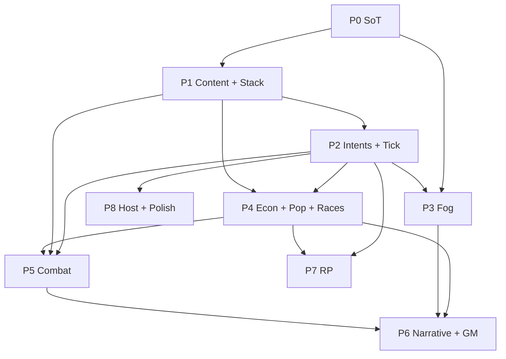

# GMap — План работ

> Версия: **1.0** · Дата: **2026-07-24**  
> Опирается на:  
> - [`CAMPAIGN_TABLE_SPEC.md`](./CAMPAIGN_TABLE_SPEC.md) (ядро стола)  
> - [`CAMPAIGN_TABLE_AMENDMENTS.md`](./CAMPAIGN_TABLE_AMENDMENTS.md) (туман, бой, расы, pop, нарратив)

Цель плана: от текущего редактора карты → **живой суточный стол** с одной правдой, AP, экономикой, боем по типам юнитов, туманом-кистью и медленным слоем населения — без расползания в MMO/VTT.

---

## 0. Как читать план

| Колонка | Смысл |
|---------|--------|
| **Этап** | вертикальный срез, который можно «закрыть» и играть |
| **Выход** | что появляется у мастера/игроков |
| **DoD** | критерий «готово», не «начали» |
| **Зависит от** | блокеры |

Оценка: **S** &lt; 1 дня · **M** 2–4 дня · **L** ~1 неделя · **XL** &gt; 1 недели  
(один разработчик + ИИ-ассистент; календарь ориентировочный.)

Параллелить можно только то, что не ломает SoT на сервере.

---

## 1. Дорожная карта (обзор)

```
NOW ──► P0 Фундамент SoT
     ──► P1 Content skeleton + ModifierStack
     ──► P2 Intents + AP + суточный тик
     ──► P3 Fog brush + reveal
     ──► P4 Ledger + налоги + pop/races (мягко)
     ──► P5 Ships/units + Engagement (space→ground→assault)
     ──► P6 Нарративные POI + беженцы + GM tools
     ──► P7 RP эпизоды
     ──► P8 Хостинг (белый IP) + polish
```

| Этап | Ориентир | Статус |
|------|----------|--------|
| P0 | сразу | **in progress / done on v_0_2** |
| P1 | после P0 | **in progress / done on v_0_2** |
| P2 | после P1 | **done (UI AP/inbox + tick)** |
| P3 | можно частично || с P2 | **partial (fog brush + reveal server)** |
| P4 | после P2 | **done on v_0_2 (ledger/tax/pop)** |
| P5 | после P1 defs + P2 tick | **done on v_0_2 (Engagement resolve)** |
| P6 | после P4 pop + P3 fog | **done on v_0_2 (POI/refugees/GM)** |
| P7 | после стабильного tick | **done on v_0_2 (RP episodes)** |
| P8 | ~29.07+ белый IP | todo |

---

## 2. Этапы подробно

### P0 — Фундамент: сервер = единственная правда стола

**Зачем:** иначе любой тик/бой/экономика разъедется с Zustand мастера.

| # | Задача | Size | Выход |
|---|--------|------|--------|
| P0.1 | Live-campaign mode: мастер читает/пишет board через API, не «тихий» local-only канон | M | draft ≠ live явно разделён |
| P0.2 | `tableRevision` / единый version endpoint | S | клиенты видят устаревание |
| P0.3 | Бэкап перед опасными операциями `data/turns/{turn}/` | S | откат хода |
| P0.4 | Нормализация published + aliases заготовка | S | миграции не падают |

**DoD:** игрок и мастер после publish/tick смотрят один и тот же board; расхождения только в pending intents.

**Зависит от:** ничего (текущий `server/api.mjs`).

---

### P1 — Content packs + ModifierStack (движок конструктора)

**Зачем:** всё остальное (налоги, расы, бой, pop) вешается на один пайплайн.

| # | Задача | Size | Выход |
|---|--------|------|--------|
| P1.1 | Каркас `content/core/` (`pack`, `rules`, `effects`, `currencies`, `id-aliases`) | M | файлы грузятся при boot |
| P1.2 | `GET /api/content` | S | UI может читать defs |
| P1.3 | Движок `buildModifierStack` + dry-run explain | L | breakdown для отладки |
| P1.4 | Вынести `SHIP_TYPES` / `RESOURCE_POOL` / POI labels в JSON (тонкая миграция) | M | дропдауны из content |
| P1.5 | Заготовка `races.json`, `taxes.json`, `intents.json` (минимальные записи) | M | не пустой скелет |

**DoD:** новый effect/currency добавляется JSON-ом и виден в stack explain; тик ещё может быть заглушкой.

**Зависит от:** P0 желателен.

---

### P2 — Intents, AP, суточный processTurn

**Зачем:** ритм стола и лимит действий.

| # | Задача | Size | Выход |
|---|--------|------|--------|
| P2.1 | Inbox intents (эволюция `player-orders`) + cancel + reserve AP | L | игроки шлют intents |
| P2.2 | `POST /api/turn/tick` + freeze + порядок resolve из спеки | L | ход закрывается сервером |
| P2.3 | Cron 00:01 MSK + boot catch-up (1 пропущенный) | M | суточный авто |
| P2.4 | Apply базовых ops: move_fleet / move_legion / claim (минимум) | L | приказы двигают мир |
| P2.5 | Turn journal + фракционный краткий briefing stub | M | текст «что изменилось» |
| P2.6 | UI: AP remaining, pending vs committed | M | вкладка «Приказы» |

**DoD:** сутки можно прогнать без ручного «подвигай все флоты»; AP режет день; бэкап тика есть.

**Зависит от:** P0, P1 (`rules.apPerTurn`, intents defs).

**Календарь:** до/около белого IP уже полезно гонять тик локально.

---

### P3 — Туман: кисть + reveal

**Зачем:** текущий fog — списки; нужен стол с закрытыми зонами.

| # | Задача | Size | Выход |
|---|--------|------|--------|
| P3.1 | Fog mask per faction (per-system v1) + persist | M | данные тумана |
| P3.2 | GM Fog Brush paint/erase | M | инструмент в редакторе |
| P3.3 | Reveal: владение, флот/легион (ephemeral), fullMapVision | M | условия открытия |
| P3.4 | Reveal от построек (маяк/обсерватория) — когда buildings в content | S | hooks |
| P3.5 | Filter `/view` от mask; визуал «слияние с фоном» | M | игрок не видит закрытое |
| P3.6 | `intent.scout_reveal` (позже можно сдвинуть) | S | разведоткрытие |

**DoD:** мастер кистью закрыл сектор → игрок не видит системы; свой флот открывает стоянку; Белатор видит всё.

**Зависит от:** P0; P2 для scout intent. Можно начинать P3.1–3.3 параллельно с концом P2.

---

### P4 — Экономика: ledger, налоги, население, расы

**Зачем:** мягкое давление и смысл Державы.

| # | Задача | Size | Выход |
|---|--------|------|--------|
| P4.1 | Stocks + ledger file/API | L | казна фракций |
| P4.2 | Income/upkeep на тике через ModifierStack | L | net в journal |
| P4.3 | `taxes.json` + `intent.set_tax` + pressure | M | налоговая политика |
| P4.4 | Deficit soft penalties как effects | S | −AP / forbid build |
| P4.5 | `races.json` traits → stack; habitability | M | расовые бафы/дебафы |
| P4.6 | Population tick: cap, growth/decline, maxLoss clamp | L | pop меняется по ходам |
| P4.7 | UI «Держава»: stocks, AP, tax, pop trend, modifier breakdown | L | игрок видит почему |
| P4.8 | `intent.transfer` | S | сделки без второй правды |

**DoD:** две фракции с одинаковыми мирами получают сравнимый gross до законов/налогов; голод/overcrowd режут pop мягко; расовый trait виден в breakdown.

**Зависит от:** P1, P2.

---

### P5 — Юниты и бой (Engagement)

**Зачем:** типы кораблей/пехоты должны решать исход.

| # | Задача | Size | Выход |
|---|--------|------|--------|
| P5.1 | `ships.json` / `units.json` с roles+stats; aliases со старых ярлыков | L | каталог боя |
| P5.2 | Легионы → `composition[]` (+ миграция strength) | M | пехота как флот |
| P5.3 | `combat_matchups` + stance mult | M | камень-ножницы ролей |
| P5.4 | Engagement entity + contact при war/attack | L | объект сражения |
| P5.5 | Commit: stance intents, lock, reserve stub | M | выбор позы за AP |
| P5.6 | Resolve space + потери по типам + journal | L | флот vs флот |
| P5.7 | Resolve ground | M | легион vs легион |
| P5.8 | Assault: orbit → landing; bombard без захвата | L | штурм планеты |
| P5.9 | Aftermath: scar, pop hit, consequence hooks | M | последствия на карте |
| P5.10 | UI карточка сражения (без тактической карты) | M | режим боя на столе |

**DoD:** разный composition → разный journal потерь; assault без десанта не даёт владение; early resolve при обоих locked работает.

**Зависит от:** P1 content, P2 tick; pop hit лучше после P4.6.

**Порядок внутри:** 5.1→5.2→5.3→5.4→5.6→5.7→5.8.

---

### P6 — Нарратив на карте + GM ops

**Зачем:** сессионный язык давления без 40 симуляторов.

| # | Задача | Size | Выход |
|---|--------|------|--------|
| P6.1 | POI пакет: refugees, quarantine, depot, propaganda (+effects) | M | маркеры с механикой |
| P6.2 | Миграция → лагеря беженцев / гумкоридор + `intent.refugee_convoy` | L | pop читается на карте |
| P6.3 | Депо ↔ upkeep / лимит атак (rules) | M | логистика фронта |
| P6.4 | Consequence brush пресеты | M | ГМ ставит последствия |
| P6.5 | GM-only notes на карте | M | скрытый слой |
| P6.6 | Timeline / таймеры узлов | M | «через 2 хода» |
| P6.7 | Шаблоны систем / пресеты POI | M | быстрый контент |
| P6.8 | Dynamic layer: фронт / Рой (v1 полилиния) | L | двигается на тике |
| P6.9 | Слой сетей врат (map mode) | S | damyl_* отдельно |

**DoD:** карантин/депо/беженцы влияют на stack или intents; ГМ закрывает узел с таймером; consequence brush ставит ожидаемый набор.

**Зависит от:** P3 (fog+quarantine), P4 (pop/refugees), P5.9 желателен для «после боя».

---

### P7 — RP эпизоды

**Зачем:** Minimal Role–like канал рядом с доской.

| # | Задача | Size | Выход |
|---|--------|------|--------|
| P7.1 | Chapter / Episode index + messages.jsonl | L | чат кампании |
| P7.2 | Типы сообщений ooc/ic/action/context/system | M | |
| P7.3 | Visibility (all / faction / gm) | M | |
| P7.4 | Action → тот же intent inbox | M | одна правда |
| P7.5 | UI вкладка «Кампания» | L | |
| P7.6 | Закрытие эпизода = read-only | S | |

**DoD:** закрыли эпизод → архив; кнопка action создаёт intent, не пишет ledger напрямую.

**Зависит от:** P2 inbox; лучше после стабильного P4.

---

### P8 — Хостинг, лаунчер, полировка

**Зачем:** стол без танцев с туннелем; вау без убийства мобилок.

| # | Задача | Size | Выход |
|---|--------|------|--------|
| P8.1 | Белый IP: постоянный `serve` + проброс, CloudPub = fallback | M | стабильный `/view` |
| P8.2 | Harden tokens, backup cron, мониторинг tick | M | |
| P8.3 | Map modes (политика/война/econ/квест/GM) | M | |
| P8.4 | Stamp хода + scar FX + export плаката | M | |
| P8.5 | Optional `cinematic` preset (выключаемый) | M | |
| P8.6 | Tauri launcher (опционально) | L | старт хоста одной кнопкой |
| P8.7 | Оценка SQLite (только если JSON болит) | M | решение go/no-go |

**DoD:** игроки заходят по IP/DNS; тик живёт при перезапуске ПК (catch-up); mobile на quality/ultralight без cinematic.

**Зависит от:** рабочий стол P2+; белый IP ~29.07.2026.

---

## 3. Ближайшие 2 недели (конкретный спринт-порядок)

Рекомендуемая нарезка **с сегодня**:

### Неделя 1

1. **P0.1–P0.3** — SoT + revision + backups  
2. **P1.1–P1.3** — content boot + ModifierStack stub  
3. **P1.4–P1.5** — вынос pool/types + минимальные races/taxes/intents JSON  
4. Старт **P2.1** — intents/AP модель данных  

### Неделя 2

5. **P2.2–P2.4** — processTurn + apply move/claim  
6. **P2.5–P2.6** — journal stub + UI AP  
7. **P3.1–P3.3** — fog mask + brush + reveal флота  
8. Если белый IP уже есть — **P8.1** параллельно (не блокирует P2)

*Не начинать P5 бой и P7 RP, пока не зелёный P2 tick.*

---

## 4. Зависимости (схема)



---

## 5. Критерии релиза стола (MVP кампании)

Минимальный «можно вести кампанию сутками»:

- [ ] P0 + P2 зелёные (тик, AP, move)  
- [ ] P3 базовый fog brush  
- [ ] P4 stocks + простой income + pop tick без миграции  
- [x] P5.1–P5.10 Engagement combat (space/ground/assault + UI)
- [ ] P8.1 доступ игрокам стабилен  

Полноценный сезон:

- [ ] + taxes, races traits  
- [ ] + ground/assault  
- [x] + refugees/quarantine/depot + GM narrative tools  
- [ ] + GM notes/timeline/consequences  
- [x] + RP episodes  

---

## 6. Риски и как режем

| Риск | Митигация |
|------|-----------|
| Размазывание на 40 POI | только приоритетный пакет P6.1 |
| Бой → тактическая игра | только Engagement + роли, без клеточного поля |
| Pop слишком быстрый/медленный | `rules.population` крутим данными, clamp убыли |
| Туман на сетке рано | v1 только per-system |
| Zustand снова стал каноном | P0 жёстко; tick только server |
| Mobile лагает от FX | cinematic off; ultralight сохраняем |
| ПК выключен в 00:01 | catch-up на boot + алерт GM |

---

## 7. Открытые решения — закрыть до старта этапа

| До этапа | Решение (дефолт из спеки) |
|----------|---------------------------|
| P2 | conflict = `submitted_at_asc`; AP не копятся |
| P3 | fog = per-system; флот = ephemeral reveal |
| P4 | tax mode = `treasury`; pop = абстрактные единицы ~1–1.5%/ход; расы = weighted by % |
| P5 | early resolve = да; retreat = по route; bombard = buildings+pop% с clamp |
| P8 | туннель остаётся fallback |

---

## 8. Следующее действие

**Стартовать P0.1** (live SoT через API) → сразу за ним **P1.1** (папка `content/core`).

Когда скажешь «начинаем» / переключишь в реализацию — идём строго по этому порядку, не прыгая в бой или RP раньше тика.

---

*План v1.0 · обновлять статусы этапов по мере закрытия DoD.*
